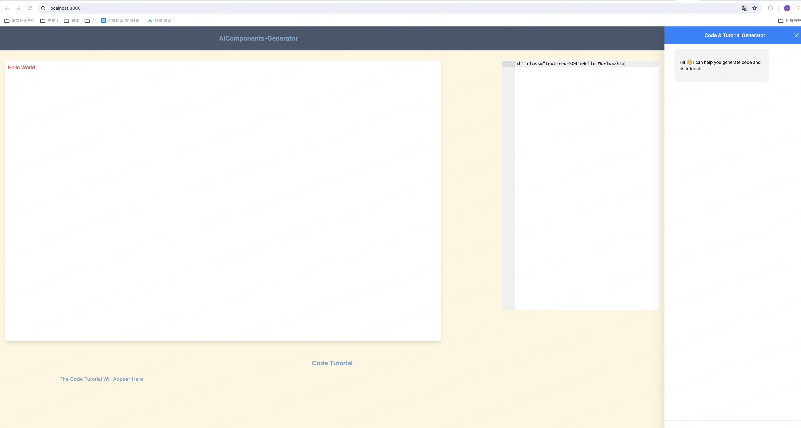
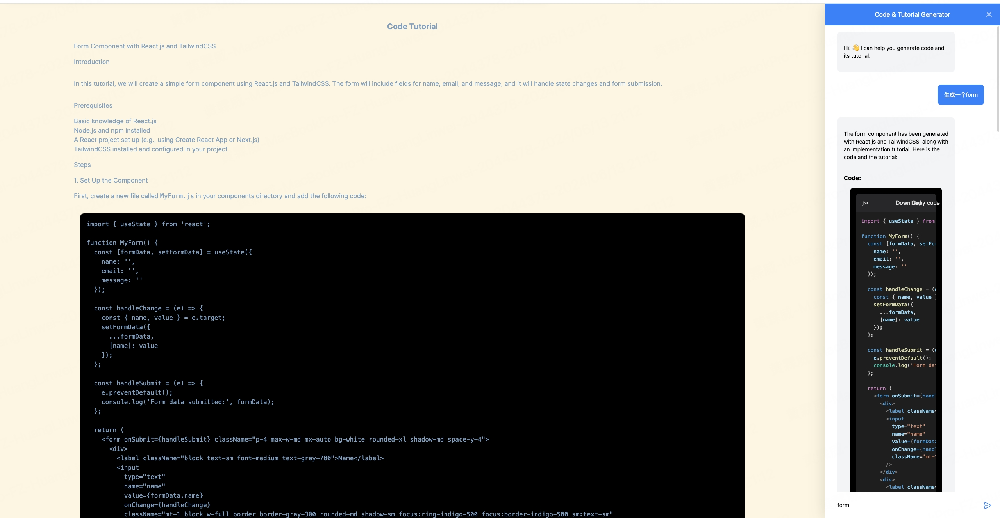

# AIComponents-Generator

## AI 驱动的前端 UI 组件生成器，它可以帮助您生成 Next.js Tailwind CSS UI 组件

-   使用 Next.js、TypeScript 和 Tailwind CSS 构建 UI 组件生成器 Web 应用程序。
-   使用 CopilotKit 将 AI 功能集成到 UI 组件生成器中。
-   集成嵌入式代码编辑器，以对生成的代码进行更改。

## 前置条件

-   [OpenAI API](https://platform.openai.com/api-keys) - 提供一个 API 密钥，使您能够使用 ChatGPT 模型执行各种任务。
-   [Tavily AI](https://app.tavily.com/home) - 一个搜索引擎，使 AI 代理能够在应用程序中进行研究并访问实时知识。


要开始，请在项目的根目录下创建一个名为.env.local的文件。然后，在文件中添加以下环境变量，这些变量将存储您的ChatGPT和Tavily搜索API密钥。
```text plain
OPENAI_API_KEY="Your ChatGPT API key"
TAVILY_API_KEY="Your Tavily Search API key"
```

启动服务

```text plain
npm run dev
# or
yarn dev
# or
pnpm dev
# or
bun dev
Open http://localhost:3000 with your browser to see the result.
```

## 效果图
[]

[]
